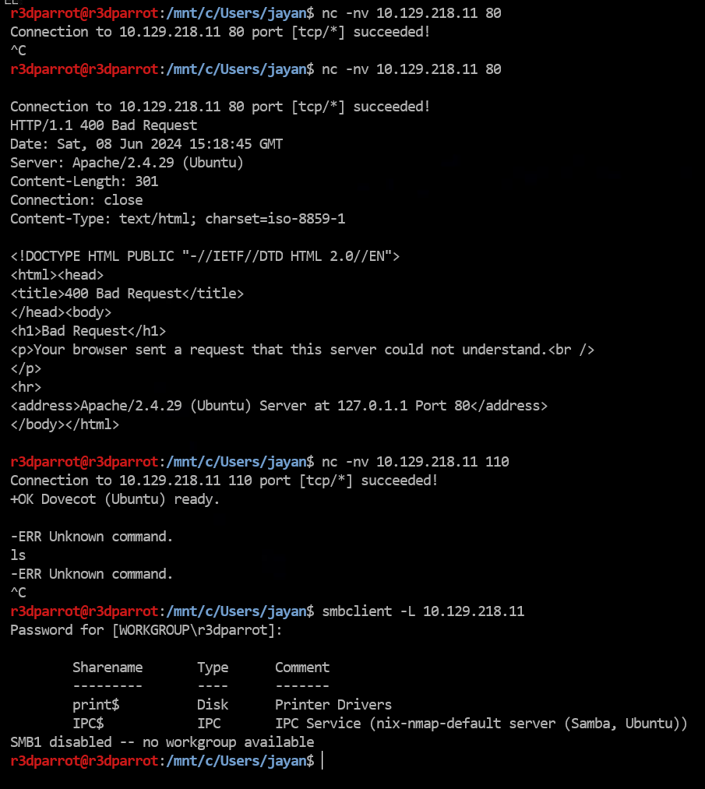

# **Nmap (Network mapper)**

## **Introduction**
<span class="red-command">How does a TCP three-way handshake is established?</span>  
When you want to talk to someone on the phone, you pick up the phone and dial the number, the receiver picks up the ringing phone not knowing who the caller is and says “Hello?,” the original caller then introduces himself by saying “Hi, this is John!” In response to this, the original receiver will often acknowledge the caller by saying “Oh, hi John!” At this point both people have enough information for the conversation to continue as normal.

Computers work much the same way. When two computers want to talk, they go through a similar process. The first computer connects to the second computer by sending a SYN packet to a specified port number. If the second computer is listening, it will respond with a SYN/ACK. When the first computer receives the SYN/ACK, it replies with an ACK packet. At this point, the two machines can communicate normally. In our phone example above, the original dialer is like sending the SYN packet. The receiver picking up the phone and saying “Hello?” is like the SYN/ACK packet and the original caller introducing himself is like the ACK packet.

Let's understand it with the help of an example:  
This is the scan report of a target network/host.
```
PORT      STATE SERVICE     VERSION
22/tcp    open  ssh         OpenSSH 7.6p1 Ubuntu 4ubuntu0.7 (Ubuntu Linux; protocol 2.0)
80/tcp    open  http        Apache httpd 2.4.29 ((Ubuntu))
110/tcp   open  pop3        Dovecot pop3d
139/tcp   open  netbios-ssn Samba smbd 3.X - 4.X (workgroup: WORKGROUP)
143/tcp   open  imap        Dovecot imapd (Ubuntu)
445/tcp   open  netbios-ssn Samba smbd 3.X - 4.X (workgroup: WORKGROUP)
31337/tcp open  Elite?
```

Let's say our machine wants to connect to port 445 via TCP.  
Before sending the connection request to the host, we would want to see all the incoming and outgoing network packets that will be exchanged between the target network and our machine.  
Listening for network traffic on specified hosts with <span class="command">tcpdump</span>

```
sudo tcpdump -i wlan0 host <TARGET_IP> and <DEV_MACHINE>
```

Sending the connection request via <span class="command">netcat</span> to PORT 445 which runs a netbios-ssn.  


<span class="red-command">Understanding the network traffic</span>  
<span class="command">Flags [S]</span> - Network packet with a SYN flag set in the TCP headers.  
<span class="command">Flags [S.]</span> - Network packet with a SYN-ACK flag set in the TCP headers.  
<span class="command">Flags [.]</span> - Network packet with a ACK flag set in the TCP headers.  

SYN - Synchronize  
ACK - Acknowledgement 

<span class="red-command">"Enumeration is the key"</span>  
The default scan setting of nmap is a TCP-SYN scan (-sS). (scan speed ~ thousand ports/second). 
The TCP-SYN scan sends one packet with the SYN flag and, therefore, never completes the three-way handshake, which results in not establishing a full TCP connection to the scanned port.

Packet flow for a TCP-SYN scan:  
1. nmap sends a TCP packet with a SYN flag to a port under scanning.  
2. If the target sends a TCP packet with a ACK flag back to the port => <span class="red-command">open</span>  
3. If the target sends a TCP packet with a RST flag back to the port => <span class="red-command">closed</span>  
4. If the target drops the incoming packets => <span class="red-command">filtered</span> and a strong firewall is in place.

### <span class="red-command">Handy Flags</span>
Lets remember some of the most common flags passed to nmap.  

| Flag                                              | Description                          |
|---------------------------------------------------|--------------------------------------|
| <span class="command">-sS</span>                  | Default nmap scan, TCP-SYN |
| <span class="command">-sT</span>                  | TCP Connect scan (stealthy for port scanning) |
| <span class="command">-n</span>                   | Don't perform DNS lookups on the IP address, which makes the connection faster because it directly uses the provided IP address. |
| <span class="command">-Pn</span>                  | Disable ICMP Echo requests |
| <span class="command">-PE</span>                  | Enable ICMP Echo requests (Useful in host discovery) |
| <span class="command">-sn</span>                  | Disable port scanning (Useful in host discovery) |
| <span class="command">-p 21</span>                | Scan port 21 |
| <span class="command">-p-</span>                  | Scan all ports |
| <span class="command">-p 21-30</span>             | Scan port 21 to 30 |
| <span class="command">-p 21,30</span>             | Scan port 21 AND 30 |
| <span class="command">--disable-arp-ping</span>   | Disable ARP Ping |
| <span class="command">--packet-trace</span>       | Trace the request and response packets |
| <span class="command">-sV</span>                  | Version scan |
| <span class="command">-oA</span>                  | Output in all formats |
| <span class="command">--stats-every=5s</span>                  | Shows the progress of the scan every 5 seconds. |
| <span class="command">-v/-vv</span>                  | Shows us the open ports directly when Nmap detects them |


## **Discovering Hosts**
Before we scan a single host for open ports and its services, we first have to determine if it is alive or not.
For discovering hosts, we need to explicitly disable port scanning through <span class="command">-sn</span> flag. If port scanning is disabled then by default ICMP Echo Requests are sent to the host.  
If the host is alive it will send an ICMP reply.

```
sudo nmap 10.10.14.24 -sn -oA host
```

### <span class="red-command">Packet trace</span>
<span class="command">-PE</span> - Performs the ping scan by using 'ICMP Echo requests' against the target.  
<span class="command">--packet-trace</span> - Tells nmap to trace the request and response packets. 
```
sudo nmap 10.10.14.24 -sn -oA host -PE --packet-trace
```

### <span class="red-command">Disable ARP requests</span>
<span class="command">--disable-arp-ping</span> - Disables ARP requests and scan our target with the desired ICMP echo requests

```
sudo nmap 10.10.14.24 -sn -PE --disable-arp-ping -oA nmap/icmpscan
```

ICMP echo request can help us determine if our target is alive and identify its system.

## **Hosts and Port Scanning**
### <span class="red-command">Discovering open TCP ports</span>
<span class="command">-p 80, 445</span> - only scans port 80 and 445.  
<span class="command">--top-ports=10</span> -  top ports from the Nmap database that have been signed as most frequent.  
<span class="command">-p 80-443</span> - scan all the ports lying in range 80 to 443.  
<span class="command">-F</span> - perform a fast scan by only scanning top 100 ports.  
<span class="command">-p-</span> - scan all the ports.  

### <span class="red-command">Packet Analysis</span>
Let's scan port 443 via TCP-SYN scan.  
<span class="command">-Pn</span> - Disable the ICMP Echo requests.  
<span class="command">-n</span> - Disable DNS resolution.  
<span class="command">--packet-trace</span> - Trace the packets.  
<span class="command">--disable-arp-ping</span> - Disables ARP requests.  

```
sudo nmap 10.10.14.24 -p 443 --packet-trace -Pn -n --disable-arp-ping
```

### <span class="red-command">TCP Connect Scan</span>
The scan sends an SYN packet to the target port and waits for a response. It is considered open if the target port responds with an SYN-ACK packet and closed if it responds with an RST packet.  
The Connect scan is useful because it is the most accurate way to determine the state of a port, and it is also the most stealthy.  

```
sudo nmap 10.10.14.24 -p 80 --packet-trace --disable-arp-ping -Pn -n --reason -sT 
```

### <span class="red-command">UDP Port Scan</span>
This will only scan top 100 ports.
```
sudo nmap 10.10.14.24 -F -sU -oA nmap/udpscan
```
To scan all the UDP ports:
```
sudo nmap 10.10.14.24 -sU -oA nmap/alludpports
```

## **Documenting the results**
When running nmap, get the nmap output in all formats via <span class="command">-oA</span> flag. Once done, we can convert the `output.xml` file to `output.html` via `xsltproc`.  
```
xsltproc output.xml -o output.html
```

## **Manual Interation with a Service**
??? question

    Manually interact with all the ports and services

First, scan the given host for all open ports and services.  

!!! note "Scan doesn't need to be always rigorous"

    We're not forcing nmap to scan for all the ports (<span class="command">-p-</span>), by default it will scan top ports.

```
sudo nmap 10.10.141.20 -sV --disable-arp-ping -Pn -n -oA nmap/services

Starting Nmap 7.94SVN ( https://nmap.org ) at 2024-06-08 12:25 UTC
Nmap scan report for 10.69.141.20
Host is up (0.16s latency).
Not shown: 993 closed tcp ports (reset)
PORT      STATE SERVICE     VERSION
22/tcp    open  ssh         OpenSSH 7.6p1 Ubuntu 4ubuntu0.7 (Ubuntu Linux; protocol 2.0)
80/tcp    open  http        Apache httpd 2.4.29 ((Ubuntu))
110/tcp   open  pop3        Dovecot pop3d
139/tcp   open  netbios-ssn Samba smbd 3.X - 4.X (workgroup: WORKGROUP)
143/tcp   open  imap        Dovecot imapd (Ubuntu)
445/tcp   open  netbios-ssn Samba smbd 3.X - 4.X (workgroup: WORKGROUP)
31337/tcp open  Elite?
1 service unrecognized despite returning data. If you know the service/version, please submit the following fingerprint at https://nmap.org/cgi-bin/submit.cgi?new-service :
SF-Port31337-TCP:V=7.94SVN%I=7%D=6/8%Time=66644DDE%P=x86_64-pc-linux-gnu%r
SF:(GetRequest,1F,"220\x20{Hello senior}\r\n");
Service Info: Host: RP-DEFAULT; OS: Linux; CPE: cpe:/o:linux:linux_kernel

Service detection performed. Please report any incorrect results at https://nmap.org/submit/ .
Nmap done: 1 IP address (1 host up) scanned in 172.59 seconds 
```

Setting up <span class="command">tcpdump</span> to listen for incoming and outgoing network packets.

```
sudo tcpdump -i wlan0 host 10.10.20.14 and 10.69.141.20
```


To interact with any port, we can use netcat to establish a connection with the port.

<span class="command">nc</span> - netcat  
<span class="command">-n</span> - Disable DNS resolution (makes the connection faster)  
<span class="command">-v</span> - Verbose (Tells about the connection details)



## **NSE**
Nmap's Scripting Engine(NSE) is a powerful feature of the Nmap network scanning tool that extends its capabilities by using scripts. These scripts can automate a wide range of tasks, from advanced version detection to vulnerability detection and exploitation. The scripts are written in the Lua programming language and can be found in the Nmap Scripting Engine's script repository.

Using nmap's default scripts to scan the target network.
```
sudo nmap 10.10.14.24 -sC
```

Using a specific script category
```
sudo nmap 10.10.14.24 --script <category>
```

Using defined scripts
```
sudo nmap <target> --script <script-name>,<script-name>,...
```

### <span class="red-command">Aggressive Scan</span>
<span class="command">-A</span> - Performs service detection, OS detection, traceroute and uses defaults scripts to scan the target.  
Let's perform an aggressive scan on port 80 with nmap's default scripts.

```
sudo nmap 10.10.14.24 -p 80 -A 
```

## **Performance**
Good but may miss some ports and hosts while scanning.

## **Lab**
What happens if an IDS and IPS is in place?  
What happens if there is no chance of interacting with the host to discover open ports, services running on them?  

???+ quote

    When the WAF says 'No', let your determination say 'Yes'. Every denial is just a disguised invitation to dig deeper


### <span class="red-command">Firewall Evasion methods</span>  
<span class="red-command">METHOD-1 : The Decoy scanning method  </span>  
<span class="command">-D</span> - The Decoy scanning method  
Decoy scanning helps to mask the actual source of the scan by including additional IP addresses in the scan request. This can confuse the target system's logging and alerting mechanisms by making it appear as though the scan is coming from multiple sources rather than a single one.  
Decoys can be used for SYN, ACK, ICMP scans, and OS detection scans

<span class="command">-D RND:4</span> - Generates four random IP addresses that indicates the source IP the connection comes from.<br><br>
<span class="red-command">METHOD-2 : TCP-ACK scan</span>  
How TCP ACK Scanning(<span class="command">-sA</span>) Works?  
Sending TCP ACK Packets: The scanner sends TCP packets with the ACK flag set to the target host. The ACK flag is used in the TCP protocol to acknowledge the receipt of packets. These packets are sent without establishing a connection (i.e., they are sent without the SYN flag). The packets with the ACK flag are often passed by the firewall because the firewall cannot determine whether the connection was first established from the external network or the internal network.

**Analyzing Responses**:

- No Response or ICMP Unreachable: If no response or an ICMP "port unreachable" message is received, it indicates that the port is either filtered (i.e., blocked by a firewall) or that the target is not reachable. 

- RST Packet: If the target responds with a TCP RST (reset) packet, it suggests that the port is unfiltered, which means the firewall is allowing traffic through but there's no service listening on that port.

<span class="red-command">unfiltered</span> - This state of a port only occurs during the TCP-ACK scan and means that the port is accessible, but it cannot be determined whether it is open or closed.  

<span class="red-command">METHOD-3 : Scan by Using Different Source IP</span>  
<span class="command">-S IP</span> - Scan the host with the source IP as any IP address that lies in the same subnet.

<span class="red-command">METHOD-3 : DNS Proxying</span>  
The DNS queries are made over the UDP port 53. The TCP port 53 was previously only used for the so-called "Zone transfers" between the DNS servers or data transfer larger than 512 bytes.  
The company's DNS servers are usually more trusted than those from the Internet. So, for example, we could use them to interact with the hosts of the internal network. As another example, we can use TCP port 53 as a source port (<span class="command">--source-port</span>) for our scans. If the administrator uses the firewall to control this port and does not filter IDS/IPS properly, our TCP packets will be trusted and passed through.

<span class="command">--source-port 53</span> - Performs the scans from specified source port.
