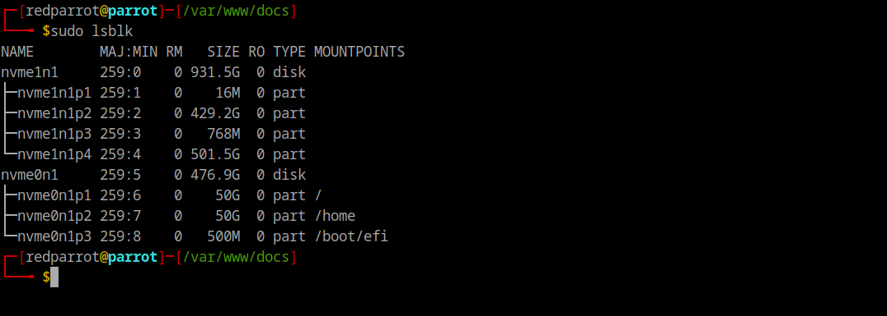
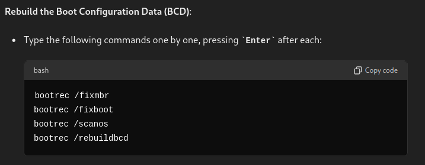
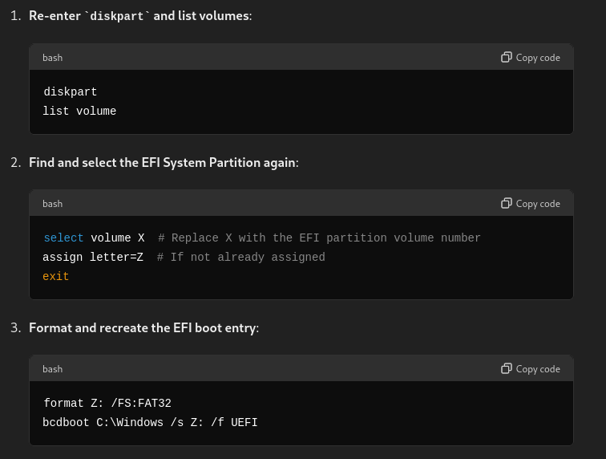
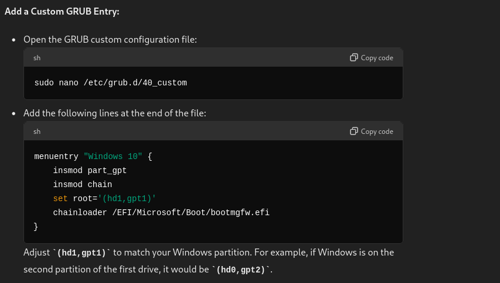

# **Operating Systems**

## **Dual boot**
<span class="red-command">Dual boot 101</span>  
Usually the host operating system is windows, let's say we want to install ParrotOS alongside.
Installing parrot OS in dual boot with windows.

**Case study**  
Laptop - DELL G5 15 SE  
Configuration - R7-4800H, 6GiB RX 5600M, 1TB + 512GB SSD (2 physical disks), 16GiB RAM.

1. Download an install [Balena Etcher](https://etcher.balena.io/){:target="_blank"}.
2. Download [ParrotOS](https://parrotsec.org/download/){:target="_blank"} ISO image.
3. Flash ParrotOS to any flash drive using balenaEtcher.
4. Once the USB is ready, restart the system.
5. Before the system boots, press F12 to boot from the flash drive.
6. [Install ParrotOS](https://www.parrotsec.org/docs/installation/dualboot-with-windows){:target="_blank"}.

**Manual Partitioning**  
The ideal way to work with a dual boot system is to keep different OSs on different physical disks.


As we can see, the `disk0` contains the host operating system. The host OS has 4 partitions.  
<span class="red-command">nvme1n1</span>     259:0    0     **931.5G**      0   disk 
├─nvme1n1p1 259:1    0    16M  0 part (System reserved)  
├─nvme1n1p2 259:2    0 429.2G  0 part (Host drive)  
├─nvme1n1p3 259:3    0   768M  0 part (System reserved and recovery)  
└─nvme1n1p4 259:4    0 501.5G  0 part (A normal partition)  

`disk1` contains the ParrotOS.  
<span class="red-command">nvme0n1</span>     259:5    0     **476.9G**      0   disk  
├─nvme0n1p1 259:6    0    50G  0 part /  
├─nvme0n1p2 259:7    0    50G  0 part /home  
└─nvme0n1p3 259:8    0   500M  0 part /boot/efi  

<span class="red-command">Problem statement</span>  
Everything went smoothly but the boot option to log into windows was not available in the bios settings (<span class="red-command">F2</span>). Also, the GRUB bootloader was not having any option to boot into the host operating system.  
The OS is present in the 1TB disk and is not corrupted or damaged, its just that somehow the boot partition got removed during the dual booting process.  
Also, you can't boot from the 1TB disk(`disk0`) that contains the host OS.  
You'll will not have this problem if you install both the operating systems in the same disk. (disk0 or disk1)

<span class="red-command">Debugging strategy</span>  
We are no more noobs, so we'll not even think about something like  
```"Oh I can't boot into windows by any means, the windows boot manager is deleted, the disk0 is not present in the boot options as well, therefore I should format the entire disk0 and reinstall Windows11".```  

First of all, let see if the boot manager is present in any of the 4 partitions of the disk0.

Mount the system reserved/recovery partition of the host OS to the `/mnt` directory of parrot OS.
```
sudo mount /dev/nvme1n1p3 /mnt
```

Check if the boot manager is present in this partition
```
ls /mnt/EFI/Microsoft/Boot/
```

If the boot manager is not present here, then this issue can't be handled from parrot OS from now onwards. Let's create an installation media for windows 11 to perform advanced recovery.  
1. Restart the system, press F12 to open the boot menu.  
2. From here we should be able to boot from all the available disks. (`disk0, disk1 or USB Generic flash drive`)
3. Boot from USB Flash drive.
4. Click on `Repair your computer`.  
  


5. Open Command Prompt in the Windows Recovery Environment.
6. Rebuild the Boot Configuration Data (BCD):



Manually recreate the EFI boot entry:



Now we have something interesting - It is possible that you won't be able to type some characters or you'll press a `\` but it will print a `#`. This may be due to a keyboard layout issue. You can still enter the required commands by using the alternative ASCII code for the backslash.

**Use ASCII Code for Backslash:**  
Hold the Alt key and type 92 on the numeric keypad (make sure Num Lock is on), then release the Alt key. This should produce a backslash (`\`).  

After this, <span class="red-command">nvme1n1p3</span> will become a partition from which you'll be able to boot into windows 11 without a single issue.  
Now antoher problem is that, the GRUB bootloader (from which parrot OS is booted) doesn't contain the option to boot into windows 11. Therefore, we have to restart the system and press F12 to open the boot menu.
From here we will select the `disk0` and it will take us directly inside Windows 11.

Another problem that may arise here is that, if you try to shutdown the windows it will not shutdown the system and will just log you out from the windows.  
This issue could be related to the Fast Startup feature in Windows, which sometimes causes problems in dual-boot setups. Fast Startup is a hybrid shutdown feature that saves the state of the operating system to a hibernation file.  


Finally, let's fix the last step and that is to add a boot entry for windows 11 in the GRUB bootloader.
1. Boot into Parrot OS.  
2. Mount <span class="red-command">nvme1n1p3</span> to the <span class="red-command">/mnt</span> directory of ParrotOS.
3. Add a Custom GRUB Entry



For this case study, it should be:


That's it, execute sudo reboot to see the below holy screen.  


## **Installing AMD GPU Graphics drivers**  
1. Install the drivers from [`install-amdgpu`](https://rocm.docs.amd.com/projects/install-on-linux/en/latest/how-to/amdgpu-install.html) binary.
2. Make sure the deb URL contains the `jammy` mirror.

``` bash
cat /etc/apt/sources.list.d/amdgpu.list
deb https://repo.radeon.com/amdgpu/6.1.3/ubuntu jammy main
#deb-src https://repo.radeon.com/amdgpu/6.1.3/ubuntu jammy main
```

3. `sudo amdgpu-install --usecase=graphics,opencl --vulkan=amdvlk,pro`
4. `sudo lshw -C display`